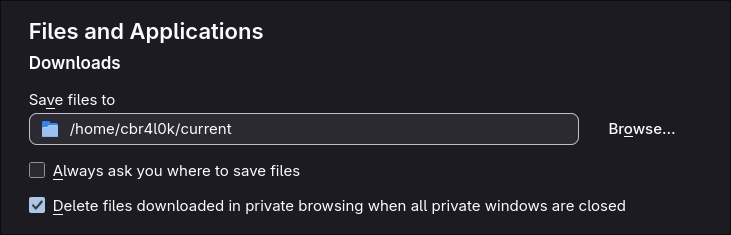
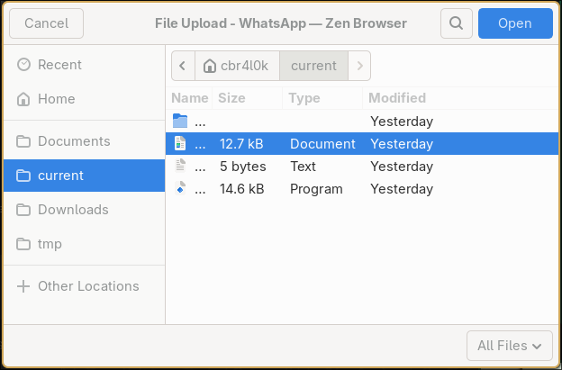

# cur

Manage a `~/current` symlink that points to your working directory. Switch projects by updating one symlink instead of remembering paths.

## Why

I live in the terminal. Most of my work happens there and it feels natural. But every now and then I need to interact with a browser or some other GUI — sending an email attachment, uploading a file for a course, sharing something on a chat app. Suddenly I'm dragging and dropping files across windows, hunting through directory trees in a file picker, or worse: downloading something into `~/Downloads` just to immediately move it into whatever project folder I'm actually working in.

That back-and-forth breaks the flow. `cur` fixes it by giving you a single, stable folder — `~/current` — that always points to wherever you're working right now. One symlink, always up to date, always reachable from any GUI.

## Install

Clone or download the repo, and then inside:

```sh
make install              # installs to /usr/local/bin (needs sudo)
sudo make install         # same, explicit
make install PREFIX=~     # installs to ~/bin (no sudo)
```

Or copy it manually:

```sh
cp cur /usr/local/bin/cur
chmod 755 /usr/local/bin/cur
```

## Usage

```
cur             Set ~/current -> $PWD
cur show        Show where ~/current points
cur go          Start a subshell in ~/current
cur force       Replace ~/current even if it is a real directory
cur unset       Remove the ~/current symlink
cur help        Print usage
```

## Tips

- **Set `~/current` as the default download folder** in your browser, Telegram, Zoom, and any other app that downloads files. New downloads land right where you need them.

    
  
- **Pin `~/current` to your file manager sidebar.** Every file picker dialog (uploads, attachments, "open file") will have your working directory one click away.

    
  
- **Add a shell function for instant `cd`.** Put this in your `.bashrc` or `.zshrc` to jump to `~/current` without a subshell:

  ```sh
  c() {
    [ -L "$HOME/current" ] && cd "$(readlink -f "$HOME/current")" \
      || echo "No ~/current symlink."
  }
  ```

  Then just run `c` from anywhere.

## Uninstall

```sh
make uninstall              # removes from /usr/local/bin
make uninstall PREFIX=~     # removes from ~/bin
```

## License

[MIT](LICENSE)
